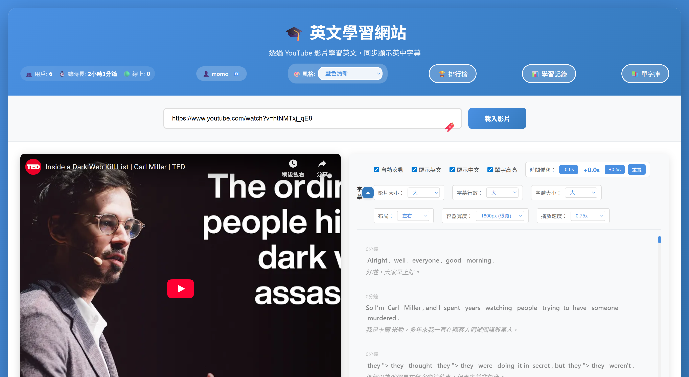
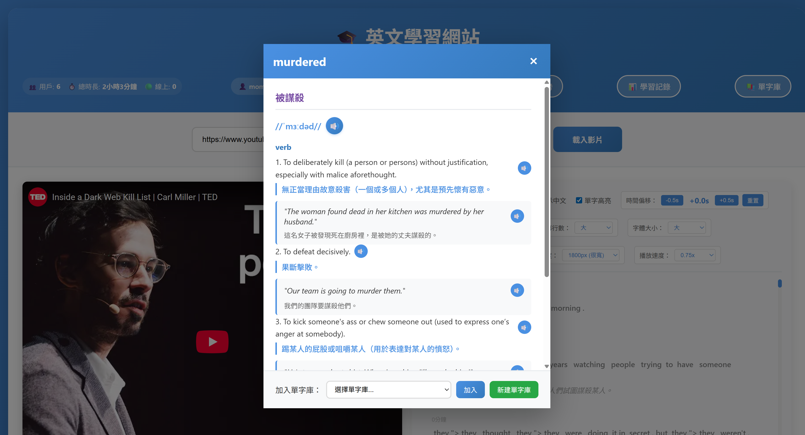
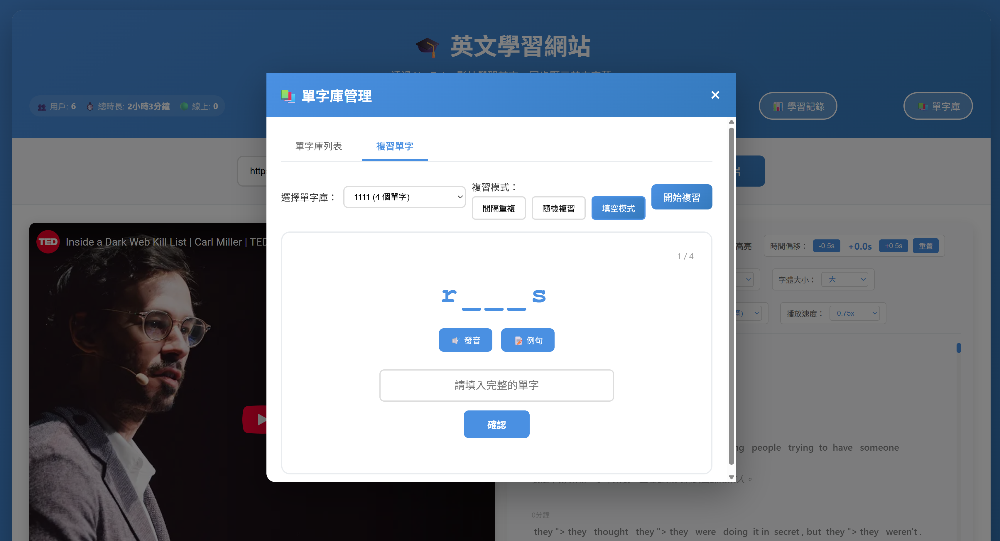

# 英文學習系統

<div align="center">

一個功能完整的英文學習平台，整合 YouTube 影片學習、個人化單字庫管理、間隔重複學習算法等功能。

[](https://www.python.org/)
[](https://flask.palletsprojects.com/)
[](LICENSE)

[功能特色](#-功能特色) • [快速開始](#-快速開始) • [使用說明](#-使用說明) • [部署指南](#-部署指南) • [技術架構](#-技術架構) • [貢獻](#-貢獻)

</div>

---

## 📖 簡介

類似功能的網站好像都要付費, 那就用Cursor來寫一個吧:D
英文學習系統是一個專為英語學習者設計的互動式學習平台。
透過 YouTube 影片提供沉浸式學習體驗，支援雙語字幕同步顯示、單字查詢、個人單字庫管理、智慧複習等功能，幫助您更有效率地學習英語。

### 主要特色

- 🎥 **YouTube 影片整合**：支援所有 YouTube 影片，自動獲取並翻譯字幕
- 📝 **雙語字幕同步**：英中對照字幕，與影片播放時間精確同步
- 🔍 **智慧單字查詢**：點擊字幕即可查看單字詳細資訊、發音、例句
- 📚 **個人單字庫**：建立多個單字庫，管理個人學習內容
- 🎯 **間隔重複學習**：採用科學的間隔重複算法，提升記憶效率
- 🏆 **學習統計**：追蹤學習時間、進度，支援排行榜功能
- 🎨 **響應式設計**：支援各種設備，提供流暢的使用體驗

## ✨ 功能特色

### 核心學習功能

- **YouTube 影片播放**：支援所有 YouTube 影片格式
- **字幕同步顯示**：自動獲取影片字幕，同步顯示英文和中文翻譯
- **時間跳轉**：點擊字幕可跳轉到對應的播放時間點
- **單字高亮**：跟隨影片播放進度，自動高亮當前單字

### 單字管理

- **單字查詢**：點擊字幕中的單字即可查看詳細資訊（翻譯、音標、詞性、例句、同義詞）
- **發音播放**：支援單字和例句的語音播放
- **單字庫管理**：建立多個個人化單字庫，分類管理學習內容
- **匯出/匯入**：支援單字庫的匯出和匯入（JSON 格式）

### 學習功能

- **智慧複習**：間隔重複學習算法，根據記憶曲線安排複習
- **學習統計**：追蹤學習時間、複習次數、準確率等數據
- **排行榜**：學習時間榜和複習成績榜，與其他學習者一起進步
- **書籤系統**：收藏常用影片，快速存取

### 用戶體驗

- **布局切換**：支援左右布局（寬螢幕）和上下布局（窄螢幕）
- **字幕控制**：調整字幕行數、顯示/隱藏中英文、時間偏移調整
- **影片控制**：調整影片大小、自動滾動字幕
- **響應式設計**：適配各種螢幕尺寸

## 🚀 快速開始

### 系統需求

- Python 3.13 或更高版本
- 穩定的網路連線（用於影片播放和翻譯）
- 現代化瀏覽器（Chrome、Firefox、Safari、Edge）

### 安裝步驟

1. **克隆專案**

```bash
git clone https://github.com/craig7351/youtube-eng.git
cd youtube-eng
```

2. **安裝依賴**

```bash
pip install -r requirements.txt
```

3. **啟動應用**

```bash
# 推薦方式（自動檢查依賴）
python run.py

# 或直接運行
python app.py
```

4. **開啟瀏覽器**

訪問 `http://localhost:5000`

## 📖 使用說明

### 網站截圖

#### 主頁面

*主頁面提供 YouTube 影片載入功能，支援多種風格主題切換*

#### 影片學習介面

*雙語字幕同步顯示，支援單字查詢、高亮、發音等功能*

#### 單字庫管理

*建立和管理多個個人單字庫，支援匯出/匯入功能*

#### 複習模式

*提供間隔重複、隨機複習、填空模式三種複習方式*

#### 學習紀錄

*紀錄學習狀態*


### 基本使用流程

#### 1. 載入影片

1. 在輸入框中貼上 YouTube 影片網址（例如：`https://www.youtube.com/watch?v=VIDEO_ID`）
2. 點擊「載入影片」按鈕或按 `Enter` 鍵
3. 等待字幕載入完成（影片可以先播放）

**提示**：
- 可以使用書籤按鈕（🔖）收藏常用影片
- 首次載入字幕可能需要幾秒鐘，請耐心等待

#### 2. 開始學習

1. **播放影片**：點擊播放按鈕開始播放
2. **查看字幕**：
   - 字幕會自動同步顯示在右側（或下方，取決於布局設置）
   - 英文和中文翻譯會同時顯示
   - 當前播放的單字會自動高亮
3. **查詢單字**：
   - 點擊字幕中的任何單字即可查看詳細資訊
   - 單字資訊包括：翻譯、音標、詞性、例句、同義詞
   - 點擊 🔊 按鈕可播放單字發音
4. **加入單字庫**：
   - 在單字資訊視窗中選擇要加入的單字庫
   - 點擊「加入單字庫」按鈕
   - 可以建立多個單字庫來分類管理

#### 3. 調整設置

**字幕控制面板**（點擊字幕區域右上角的三角形按鈕展開/收起）：
- **自動滾動**：字幕自動跟隨播放進度滾動
- **顯示英文/中文**：切換顯示或隱藏英文/中文翻譯
- **單字高亮**：開啟/關閉當前單字高亮功能
- **時間偏移**：調整字幕與影片的同步時間（±0.5秒）
- **影片大小**：小、中、大
- **字幕行數**：小、中、大
- **字體大小**：小、中、大
- **布局**：左右（寬螢幕）或上下（窄螢幕）
- **容器寬度**：1200px ~ 1800px 或 100% 全寬
- **播放速度**：0.25x ~ 2x

**風格主題**：
- 預設風格（紫色）
- 藍色清新
- 綠色自然
- 橙色活力
- 深色專業

#### 4. 複習單字

1. **進入複習模式**：
   - 點擊頂部「📚 單字庫」按鈕
   - 選擇「複習單字」標籤

2. **選擇複習模式**：
   - **間隔重複**：根據記憶曲線安排複習，優先複習需要加強的單字
   - **隨機複習**：隨機打亂順序，全面複習單字庫中的所有單字
   - **填空模式**：顯示部分字母，填入完整單字，適合拼寫練習

3. **開始複習**：
   - 選擇要複習的單字庫
   - 選擇複習模式
   - 點擊「開始複習」按鈕
   - 根據提示進行複習（認識/不認識 或 填空）

**填空模式詳細說明**：
- 系統會顯示單字的部分字母（例如：`a___a__y`）
- 點擊 🔊 按鈕可聽發音
- 點擊 📝 例句按鈕可查看例句（單字以 `*****` 替代）
- 在輸入框中填入完整的單字
- 點擊「確認」查看答案
- 系統會顯示正確或錯誤，並提供正確答案

### 快捷操作

- **Enter 鍵**：在影片網址輸入框中按 Enter 鍵快速載入影片
- **點擊字幕**：點擊字幕中的時間標記可跳轉到對應的播放時間點
- **ESC 鍵**：關閉單字資訊視窗或 Modal 視窗
- **書籤快捷鍵**：點擊 🔖 按鈕快速收藏/載入常用影片

### 進階功能

#### 單字庫管理
- **新建單字庫**：點擊「+ 新建單字庫」按鈕，輸入單字庫名稱
- **查看單字庫**：點擊「查看」按鈕查看單字庫中的所有單字
- **匯出單字庫**：點擊「📥 匯出」按鈕，將單字庫匯出為 JSON 文件
- **匯入單字庫**：點擊「📤 匯入」按鈕，從 JSON 文件匯入單字庫
- **刪除單字庫**：點擊「刪除」按鈕刪除不需要的單字庫

#### 學習統計
- **查看學習記錄**：點擊「📊 學習記錄」按鈕查看詳細的學習統計
- **查看排行榜**：點擊「🏆 排行榜」按鈕查看學習時間榜和複習成績榜
- **暱稱管理**：點擊暱稱旁的 🔄 按鈕可修改暱稱

## 🛠️ 技術架構

### 技術棧

- **前端**
  - HTML5, CSS3, JavaScript (ES6+)
  - YouTube IFrame API
  - 響應式設計

- **後端**
  - Flask (Python Web 框架)
  - yt-dlp (字幕獲取)
  - Google Translate API (翻譯服務)
  - Google Text-to-Speech API (語音合成)

- **數據存儲**
  - JSON 文件存儲（單字庫、用戶數據、快取）

### 專案結構

```
youtube-eng/
├── app.py                 # Flask 主應用程式
├── run.py                 # 啟動腳本（自動檢查依賴）
├── requirements.txt       # Python 依賴
├── templates/
│   └── index.html        # 主頁面模板
├── static/
│   ├── style.css         # 樣式文件
│   └── script.js         # 前端邏輯
├── word_banks.json       # 單字庫數據
├── user_data.json        # 用戶學習統計
├── subtitle_cache.json   # 字幕快取
├── translation_cache.json # 翻譯快取
└── bookmarks.json        # 書籤數據
```

## 🚀 部署指南

本專案支援多種雲端平台部署，推薦使用 **Render** 或 **Railway**，它們都支援 GitHub 自動部署。

### 快速部署（推薦：Render）

1. **準備 GitHub 倉庫**
   - 確保專案已推送到 GitHub

2. **註冊 Render 帳號**
   - 前往 [Render](https://render.com)
   - 使用 GitHub 帳號註冊/登入

3. **創建 Web Service**
   - 點擊「New +」→「Web Service」
   - 連接您的 GitHub 倉庫
   - 配置如下：
     - **Build Command**: `pip install -r requirements.txt`
     - **Start Command**: `gunicorn app:app --bind 0.0.0.0:$PORT --workers 2 --timeout 120`
     - **Plan**: `Free`（免費方案）

4. **部署完成**
   - Render 會自動構建和部署
   - 完成後會提供一個 URL（例如：`https://youtube-eng.onrender.com`）

### 其他部署平台

- **Railway**: 支援 GitHub 自動部署，免費方案可用
- **Fly.io**: 支援 GitHub 自動部署，全球 CDN

### 詳細部署說明

請參考 [DEPLOYMENT.md](DEPLOYMENT.md) 查看完整的部署指南，包括：
- 各平台的詳細步驟
- 環境變數配置
- 故障排除
- 生產環境建議

## 📝 開發

### 環境設置

```bash
# 安裝開發依賴
pip install -r requirements.txt

# 啟動開發伺服器
python run.py
```

### 打包為可執行檔

```bash
# Windows
build_exe.bat
```

## 🤝 貢獻

歡迎貢獻！請遵循以下步驟：

1. Fork 本專案
2. 建立功能分支 (`git checkout -b feature/AmazingFeature`)
3. 提交更改 (`git commit -m 'Add some AmazingFeature'`)
4. 推送到分支 (`git push origin feature/AmazingFeature`)
5. 開啟 Pull Request

## 📄 授權

本專案採用 MIT 授權條款。詳見 [LICENSE](LICENSE) 文件。

## 👤 作者

**Craig Huang**

- Email: craig7351@gmail.com

## 🙏 致謝

- [yt-dlp](https://github.com/yt-dlp/yt-dlp) - YouTube 影片和字幕下載
- [Flask](https://flask.palletsprojects.com/) - Python Web 框架
- [deep-translator](https://github.com/nidhaloff/deep-translator) - 翻譯服務

## 📚 相關文件

- [使用手冊](USER_GUIDE.md) - 詳細的使用說明
- [更新記錄](CHANGELOG.md) - 版本更新歷史

## ⚠️ 注意事項

- 📡 需要網路連線才能使用（影片播放、字幕獲取、翻譯）
- 🎥 部分影片可能沒有字幕或字幕不可用
- 🌐 翻譯品質取決於 Google Translate 的準確度
- ⏳ 首次載入字幕可能需要等待（特別是長影片）
- 💾 學習資料儲存在本地 JSON 文件中，建議定期備份

## 🔮 未來計劃

- [ ] 改進單字高亮算法，提高準確度
- [ ] 改進間隔重複學習算法
- [ ] 支援多語言字幕
- [ ] 添加字幕下載功能

詳見 [更新記錄](CHANGELOG.md) 了解最新功能和改進。

---

<div align="center">

**如果這個專案對您有幫助，請給一個 ⭐ Star！**

Made with ❤️ by Craig Huang

</div>
